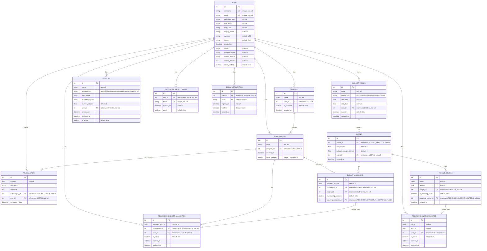

# Database Entity Relationship Diagram

## Visual ERD

## Entity Descriptions

### Core Entities

#### USER
The central entity representing application users. Stores authentication credentials, profile information, and preferences.

#### CATEGORY
Top-level categorization of transactions. Each category belongs to a user and can contain multiple subcategories.

#### SUBCATEGORY
Detailed categorization within categories. Has a unique constraint on `(name, category_id)` to prevent duplicates within the same category.

#### TRANSACTION
Financial transactions (expenses) recorded by users. Amounts are stored as negative values for expenses. Linked to both user and subcategory.

### Budget Management Entities

#### BUDGET_PERIOD
Time-based organization for budgets (e.g., "January 2024", "Q1 2024"). Only one period can be active per user at a time.

#### BUDGET
Financial plan associated with a budget period. Tracks total income and balance brought forward.

#### BUDGET_ALLOCATION
Links budget amounts to specific subcategories. Can be marked as recurring if derived from a recurring allocation template.

#### INCOME_SOURCE
Income entries for a specific budget. Can be linked to a recurring income source template.

### Recurring Templates

#### RECURRING_INCOME_SOURCE
Template for recurring income that can be automatically applied to new budgets.

#### RECURRING_BUDGET_ALLOCATION
Template for recurring budget allocations that can be automatically applied to new budgets.

### Account Management

#### ACCOUNT
Financial accounts (checking, savings, credit cards, etc.) owned by users. Supports soft deletion via `is_active` flag.

### Authentication

#### PASSWORD_RESET_TOKEN
Temporary tokens for secure password reset functionality.

#### EMAIL_VERIFICATION
Tokens for email verification during registration.

## Relationship Summary

- **USER** has one-to-many relationships with all other entities
- **CATEGORY** to **SUBCATEGORY**: One-to-many (cascade delete)
- **SUBCATEGORY** to **TRANSACTION**: One-to-many
- **SUBCATEGORY** to **BUDGET_ALLOCATION**: One-to-many
- **BUDGET_PERIOD** to **BUDGET**: One-to-many (one budget per period)
- **BUDGET** to **BUDGET_ALLOCATION**: One-to-many
- **BUDGET** to **INCOME_SOURCE**: One-to-many
- **RECURRING_INCOME_SOURCE** to **INCOME_SOURCE**: One-to-many (optional)
- **RECURRING_BUDGET_ALLOCATION** to **BUDGET_ALLOCATION**: One-to-many (optional)

## Key Constraints

1. **Unique Username & Email**: Each user must have a unique username and email
2. **Unique Subcategory Name per Category**: Cannot have duplicate subcategory names within the same category
3. **Single Active Period**: Only one budget period can be active per user at a time
4. **Cascade Deletes**: 
   - Deleting a user deletes all related data
   - Deleting a category deletes its subcategories
   - Deleting a budget period deletes its budgets
   - Deleting a budget deletes its allocations and income sources

## Notes

- Transaction amounts are stored as **negative values** for expenses
- The `is_active` flag on accounts and recurring items allows for soft deletion
- Budget allocations can be marked as recurring if they come from recurring templates
- The unique constraint on subcategories prevents duplicate names within categories

